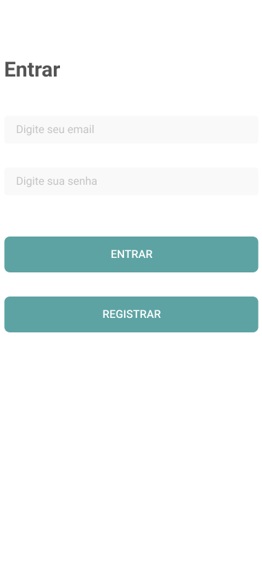
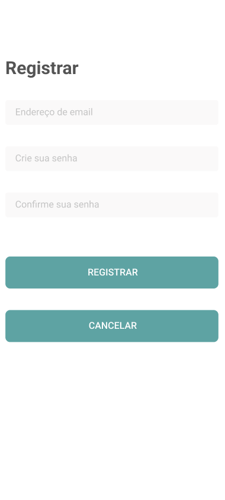
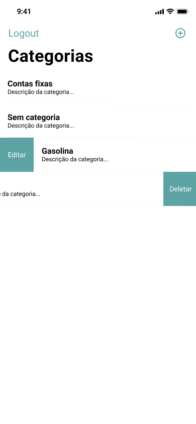
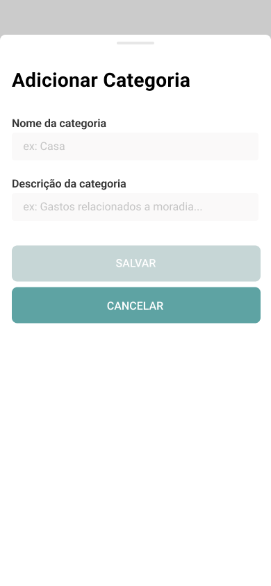
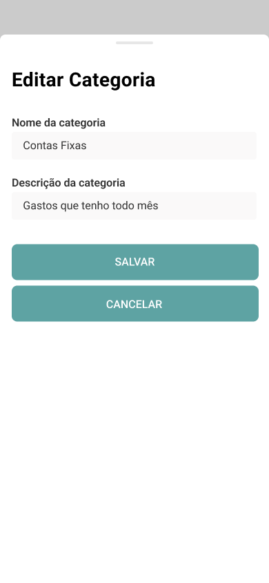
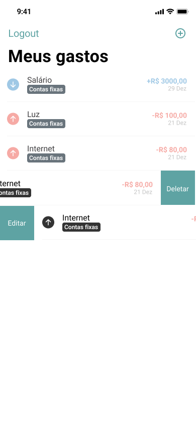

# Teste - iOS - Meus gastos

O objetivo deste teste é avaliar as habilidades do candidato em desenvolver um aplicativo para controle de gastos.

Os protótipos de telas estão no repositório para desenvolvimento do layout.

O tempo estimado para a conclusão deste teste é de 1 semana, entregar o melhor app possível visando a qualidade de código/projeto e a parte visual.

## Requisitos de negócios:

* No primeiro acesso ao aplicativo, o usuário deverá fazer o registro;
* Tratamento de erros no processo de login;
* Cadastro de categorias de gastos, como:
  * Moradia (aluguel)
  * Alimentação
  * Transporte
  * Educação
* O usuário poderá cadastrar entradas e saídas de gastos;
* Cadastrar no mínimo 2 valores, 1 entrada e 1 saída, para cada categoria.
* Possibilidade de exclusão e edição dos gastos e categorias cadastrados;
* Tratamento de erros nas requisições da API;
* Na tela de GastosInfo, exibir totalizadores com a soma dos valores de entrada e saída.

## Requisitos técnicos:

* Utilizar linguagem Swift 5+ com UIKit;
* Utilizar chamadas às APIs disponíveis;
* Respeitar os princípios do SOLID;
* Boas práticas, CleanCode;
* Aplicar Design Patterns, orientação a objetos e boas práticas de programação;
* Desenvolver as interfaces em viewCode;
* Seguir a arquitetura MVVM ou MVVM-C;
* Implementar o login utilizando o Firebase;
* Usar o framework nativo URLSession para realizar as chamadas de API;
* Os testes unitários são opcionais, porém recomendados.

Utilize a seguinte [API](http://meusgastos.codandocommoa.com.br/swagger/ui/index#/)

| Não envie a solução como anexo, suba os fontes para seu Github (ou outro repositório) e envie o link para o avaliador.

## Detalhes técnicos sobre a API:

* A API é HTTP, não HTTPS
* Para salvar ou obter categorias, não precisará do EntryType, ele não precisa ser enviado no HTTP Body e nem virá como response;
* Nenhum item precisará de DataCriacao, DataAlteracao e Uid, mesmo que estejam na API;
* O EntryType poderá ser String ou Int, no caso, o POST deve-se mandar o nome do elemento do vetor [“Entrada”, “Saida”] como String e no GET, a resposta será do índice do vetor [“Entrada”, “Saida”]  que virá como Int.
* Ao salvar o lançamento, enviar o valor do CategoryId como Int e a categoria como nula. A categoria será obtida pela chamada /Api/Categorys/GetCategoryById.

## Sprint 1

 

## Sprint 2

   
 
  

## Sprint 3

   
 
   

## Sprint 4

 
